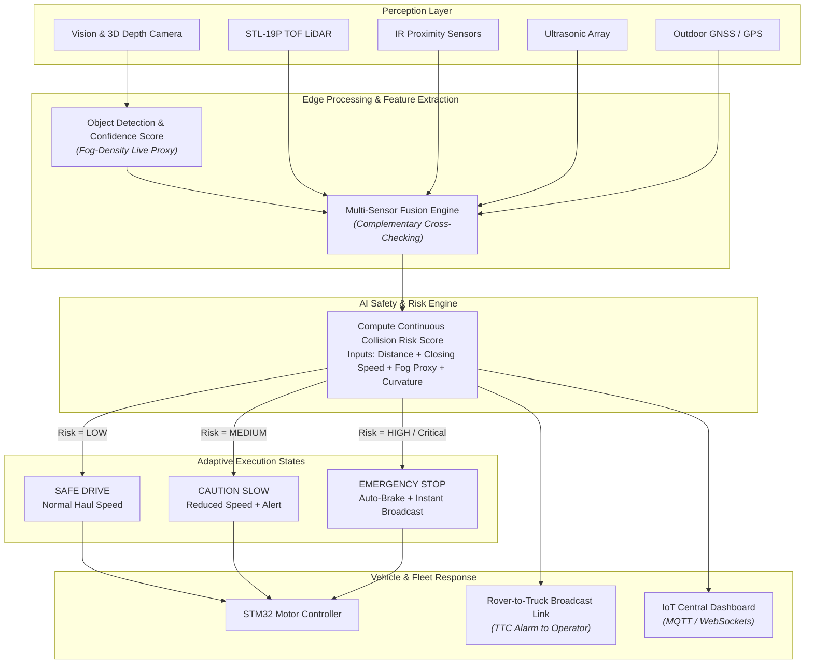

# 🚜 FogBot — Safe & Efficient Operation of Mine Vehicles in Fog and Low-Visibility Conditions

[](https://www.sih.gov.in/)
[](https://github.com/Arka-124/FogBot)
[](https://github.com/Arka-124/FogBot)
[](https://opensource.org/licenses/ISC)
[](https://nodejs.org/)
[](https://threejs.org/)
[](docker-compose.yml)

> **Smart India Hackathon 2026 — Project Report & Software Command Center**  
> **Problem Statement ID**: `SIH26007` | **Organization**: NMDC Limited  
> **Team**: Track Decoders | **Repository**: [github.com/Arka-124/FogBot](https://github.com/Arka-124/FogBot)  
> **Live Web Presence & Digital Twin**: [fogbot.onrender.com](https://fogbot.onrender.com)

---

## 📌 Table of Contents
1. [Executive Overview & Problem Statement](#1-executive-overview--problem-statement)
   - [The Bailadila Monsoon Fog Crisis](#the-bailadila-monsoon-fog-crisis)
   - [Documented Industry Hazards & Real-World Precedents](#documented-industry-hazards--real-world-precedents)
   - [Why Existing Aids Fail: Critique of Bailadila's Existing Smart DAS](#why-existing-aids-fail-critique-of-bailadilas-existing-smart-das)
2. [Our Chosen Approach: Leading Pilot Rover — FogBot](#2-our-chosen-approach-leading-pilot-rover--fogbot)
   - [Core Concept: The Dumper's Autonomous "Eyes"](#core-concept-the-dumpers-autonomous-eyes)
   - [Engineering Risk vs. Mitigation Matrix](#engineering-risk-vs-mitigation-matrix)
3. [Prototype Hardware & Decided Sensor Stack](#3-prototype-hardware--decided-sensor-stack)
   - [Physical Prototype Hardware Specs](#physical-prototype-hardware-specs)
   - [Final Multi-Sensor Stack](#final-multi-sensor-stack)
   - [Deliberate Hardware Omissions & Fog Proxy Innovation](#deliberate-hardware-omissions--fog-proxy-innovation)
4. [Sensor Fusion & AI Decision Pipeline](#4-sensor-fusion--ai-decision-pipeline)
   - [Architecture Flowchart](#architecture-flowchart)
   - [Collision Risk Scoring Engine](#collision-risk-scoring-engine)
   - [Dynamic Adaptive Speed Logic](#dynamic-adaptive-speed-logic)
   - [Rover ↔ Haul Truck Link & Mandatory Fail-Safe Stop](#rover--haul-truck-link--mandatory-fail-safe-stop)
5. [Software Architecture, Command Center & 3D Digital Twin](#5-software-architecture-command-center--3d-digital-twin)
   - [Two-Track Agile Strategy (Hardware ‖ Software)](#two-track-agile-strategy-hardware--software)
   - [Web Presence & Live Condition Monitor (`index.html`)](#web-presence--live-condition-monitor-indexhtml)
   - [Interactive 3D Digital Twin (`rover3d.bundle.js` / Three.js)](#interactive-3d-digital-twin-rover3dbundlejs--threejs)
   - [Production-Grade Operator Login Gateway (`login.html` & `server.js`)](#production-grade-operator-login-gateway-loginhtml--serverjs)
   - [Central IoT Telemetry Architecture & JSON Schema](#central-iot-telemetry-architecture--json-schema)
   - [Judge-Facing Controls: Live Fog-Density Slider & E-Stop](#judge-facing-controls-live-fog-density-slider--e-stop)
6. [Repository Structure](#6-repository-structure)
7. [Quickstart & Local Installation Guide](#7-quickstart--local-installation-guide)
8. [Cloud Deployment Blueprints (Render & Railway)](#8-cloud-deployment-blueprints-render--railway)
9. [Milestone Roadmap & Feature Priority Tiers](#9-milestone-roadmap--feature-priority-tiers)
10. [Judge Demo Narrative (7-Step Story Arc)](#10-judge-demo-narrative-7-step-story-arc)
11. [Open Engineering Questions & Future Horizons](#11-open-engineering-questions--future-horizons)
12. [Team & Acknowledgments](#-team--acknowledgments)

---

## 1. Executive Overview & Problem Statement

### The Bailadila Monsoon Fog Crisis
NMDC’s **Bailadila Iron Ore Complex** (Kirandul and Bacheli Complexes in Dantewada, Chhattisgarh) is one of India's largest and highest-grade mechanized iron ore deposits. However, during the prolonged monsoon season, dense hilltop clouds and heavy fog settle across the opencast mines, dropping visibility to a critical **3–5 meters** on narrow, winding hilltop haul roads.

This environmental bottleneck costs the complex **50–60 operational days per year**, creating:
- **Catastrophic Collision Risks**: High-capacity Heavy Earth Moving Machinery (HEMM) dumpers operating within blind stopping distances of other dumpers, light utility vehicles (LUVs), water tankers, and maintenance personnel.
- **Forced Haulage Halts**: Inability to safely navigate hilltop curves leading to complete stoppage of haul cycles.
- **Depressed Fleet Productivity & Ore Evacuation**: Bailadila currently produces ~37 MTPA, with aggressive strategic expansion targets of **80 MT by 2030**. Losing nearly two full months of haul operations per annum threatens national raw material supply chains.
- **Inadequacy of Traditional Aids**: Conventional headlights, high-intensity fog lamps, reflective road markers, and basic microwave radars scatter or blind operators in zero-visibility conditions.

---

### Documented Industry Hazards & Real-World Precedents

| Incident / Mining Case | Documented Finding / Impact | Relevance to FogBot Architecture |
|---|---|---|
| **Mine Haul Road Fatality Investigation (2010)** | Haul truck operator locked brakes on an unlit road before rear-ending a stationary lead vehicle. | Haul trucks cannot stop instantaneously on mine grades; alerts must originate ahead of the vehicle. |
| **NSW Open-Cut Near-Miss (2021)** | 240-tonne haul truck narrowly missed a light vehicle at an intersection due to blind spots. | Validates necessity of autonomous active forward scanning and cross-vehicle safety broadcast. |
| **Open-Pit Collision Statistics (2020–2023)** | **12% surge** in truck-ancillary collisions; **~25%** of collisions involve another heavy vehicle within 50 m. | Proves that human line-of-sight in industrial environments is inherently flawed during degraded weather. |
| **Vale’s Carajás Complex Weather Halts** | Mine halted production across rainy/foggy shifts; output fell **19.1% QoQ** due to weather stoppages. | Highlights that global mining leaders suffer identical bottlenecks without leading guidance. |
| **Rio Tinto Pilbara Weather Disruption** | Disrupted evacuation lost **~13 million tonnes** in a single quarter. | Direct fiscal proof that solving 50–60 lost days unlocks massive enterprise ROI for NMDC. |

---

### Why Existing Aids Fail: Critique of Bailadila's Existing Smart DAS
A field-tested **Smart Driving Assistance System (DAS)** is already deployed at Bailadila's Bacheli Complex. It integrates:
1. Differential GNSS tracking
2. Proximity radars mounted on truck bumpers
3. Anti-collision forward laser projection lines
4. Electrically heated road-edge guidance lighting

**The Crucial Insight**: Despite this installed infrastructure, **the site still loses 50–60 days every single year**.
- **The Truck-Mounted Sensor Fallacy**: Mounting sensors directly on an 85- to 240-tonne HEMM truck means the sensors are subject to heavy chassis vibration, immense dust accumulation, and are physically situated inside the same dense fog bank that blinds the driver. If an obstacle is detected 8 meters ahead of a loaded dumper traveling at haul speed on a 1:16 gradient, physical braking distance exceeds the detection distance.
- **FogBot’s Paradigm Shift**: Rather than trying to enhance the truck's degraded cockpit perspective, FogBot decouples sensing from hauling. A dedicated, agile pilot rover travels **ahead** of the truck, penetrating the fog first, establishing a safe buffer, and feeding processed trajectory intelligence back to the trailing driver.

---

## 2. Our Chosen Approach: Leading Pilot Rover — FogBot

Instead of retrofitting capital-intensive sensor suites onto hundreds of individual haul trucks, our team is building **FogBot** — an autonomous, purpose-engineered pilot rover that precedes the haul truck, holding a dynamic safety distance and acting as the vehicle’s **forward eyes and scout**.

```
[ HAUL ROAD PATH ]
========================================================================================
     [ FogBot Pilot Rover ]  <--- Dynamic Distance (15-25m) --->  [ HEMM Dumper Truck ]
     • 360° STL-19P LiDAR                                          • Operator Display
     • CV Camera + 3D Depth                                        • High-Decibel Siren
     • Ultrasonic + IR Arrays                                      • Linked E-Stop Trigger
     • AI Collision Risk Engine                                    • Following Safe Speed
========================================================================================
```

### Engineering Risk vs. Mitigation Matrix

| Engineering Challenge / Risk | Severity | Root Cause | FogBot Architectural Mitigation |
|---|---|---|---|
| **Rover navigating zero visibility** | High | Rover faces the same dense fog as the truck. | Rover carries the full multi-sensor fusion stack (**LiDAR + CV Camera + IR Proximity + Ultrasonic + GNSS**), computing safety scores at ground level. |
| **Stalled / Crashed Rover hazard** | Critical | A disabled rover directly in front of a loaded 100t dumper is an immediate collision hazard. | **Mandatory Fail-Safe Protocol**: Dual-redundant heartbeat. If rover loses localization, battery, or motor heartbeat, an immediate broadcast triggers auto pull-off or instantaneous hard-stop alert to the trailing truck. |
| **Constant-distance holding** | Medium | Commercial GPS suffers from 3–5m drift in hilly terrain. | Rover fuses GPS absolute position with real-time wheel odometry and close-range IR/ultrasonic telemetry; planned UWB ranging module for sub-meter gap precision. |
| **Rover-to-Truck coordination complexity** | Medium | Dynamic telemetry transmission in remote pit conditions. | Low-latency direct RF / Wi-Fi mesh telemetry broadcast backed by standard MQTT/WebSocket publish-subscribe architecture. |

---

## 3. Prototype Hardware & Decided Sensor Stack

### Physical Prototype Hardware Specs
Our functional proof-of-concept prototype is built on an industrial **MentorPi-style robotics platform** engineered for rugged embedded perception:

* **Primary Edge Compute**: **Raspberry Pi 5 (4GB RAM)** running 64-bit Linux OS for computer vision inference, sensor fusion processing, and telemetry broadcasting.
* **Low-Level Motion Control**: **STM32 ARM Cortex microcontroller** handling closed-loop PID motor control, encoder feedback, ultrasonic/IR interrupts, and emergency stop relays.
* **Actuation & Drive**: High-performance metal gear DC encoder motors providing precise odometry feedback.
* **Power Delivery**: High-discharge LiFePO4 / Li-ion multi-cell power regulation with isolated logic and motor power rails.

---

### Final Multi-Sensor Stack

```
+-----------------------------------------------------------------------------------+
|                            FOGBOT PERCEPTION SUITE                                |
+------------------------------------+----------------------------------------------+
| SENSOR                             | PRIMARY OPERATIONAL FUNCTION                 |
+------------------------------------+----------------------------------------------+
| STL-19P TOF LiDAR                  | Medium/long-range 360° point-cloud mapping,  |
|                                    | SLAM localization, haul road edge detection   |
| Vision Camera + 3D Depth Camera    | Real-time obstacle classification (dumpers,  |
|                                    | boulders, personnel) & depth point mapping    |
| IR Distance Sensors                | High-speed close-range obstacle confirmation  |
| Ultrasonic Sensor Array            | Complementary acoustic ranging (penetrates    |
|                                    | dark, glossy, and reflective mud surfaces)    |
| GNSS / GPS Module                  | Haul road waypoint tracking and map spatial   |
|                                    | coordinates                                  |
+------------------------------------+----------------------------------------------+
```

### Deliberate Hardware Omissions & Fog Proxy Innovation
1. **Explicitly Excluded Hardware**:
   - ❌ **Thermal Imaging Cameras**: Rejected due to high thermal noise and blooming caused by rain droplets and saturated moisture in tropical monsoon clouds.
   - ❌ **mmWave Radar**: Omitted from current build to avoid multi-path scattering against wet, steep iron ore bench faces, and to drastically lower hardware bill of materials (BOM).
2. **The CV Detection-Confidence "Fog Proxy"**:
   Rather than purchasing dedicated, expensive optical scatterometers or transmissometers, FogBot turns its optical camera into a real-time fog meter:
   $$\text{Fog Density Proxy} \propto 1.0 - \text{Confidence}_{\text{CV Model}}(\text{Known Markers / Terrain})$$
   As water droplets attenuate light transmission, convolutional feature confidence decays predictably. When camera confidence drops, the AI safety engine dynamically shifts sensor weighting toward LiDAR and ultrasonic readings, while recalculating safe stopping distances.

---

## 4. Sensor Fusion & AI Decision Pipeline

### Architecture Flowchart



### Collision Risk Scoring Engine
Rather than relying on basic binary obstacle flags ("obstacle detected: yes/no"), FogBot's embedded safety core executes continuous multi-parameter risk evaluation:
$$\text{Risk Score} = f\Big(\Delta d_{\text{rover-truck}},\, v_{\text{closing}},\, (1 - C_{\text{cam}}),\, d_{\text{obstacle}},\, \kappa_{\text{road}}\Big)$$
- If camera confidence $C_{\text{cam}}$ drops, the system classifies environmental fog as severe and contracts safe threshold buffers.
- If distance to obstacle $d_{\text{obstacle}}$ falls below the physical stopping envelope for current speed, risk escalates instantly to **HIGH**.

### Dynamic Adaptive Speed Logic

| Camera Confidence $C_{\text{cam}}$ (Fog Proxy) | Haul Road Visibility | AI System Behavior & Actuation | Recommended Speed |
|---|---|---|---|
| **High (> 75%)** | Clear / High (> 50m) | Normal autonomous pilot mode; full LiDAR SLAM path execution. | **15–20 km/h** |
| **Moderate Drop (40%–75%)** | Light Fog (20m–50m) | Proactive deceleration; sensor fusion shifts higher weight to LiDAR. | **10–14 km/h** |
| **Sharp Drop (15%–40%)** | Dense Fog (5m–20m) | Crawl speed; heightened ultrasonic and IR close-range hazard polling. | **5–8 km/h** |
| **Near-Zero (< 15%)** | Critical (3m–5m) | **Emergency Hold/Stop**: flashing rear beacon, siren, halt truck before hazard. | **0 km/h (HOLD)** |

---

### Rover ↔ Haul Truck Link & Mandatory Fail-Safe Stop
The pilot rover coordinates with its assigned trailing HEMM dumper via an ultra-reliable wireless safety channel:
1. **Continuous Distance-Hold Control Loop**: The rover broadcasts its real-time GPS coordinates, velocity, and computed safety envelope. The dumper cab receiver displays distance gap, relative speed, and calculated **Time-to-Collision (TTC)**.
2. **Immediate Fail-Safe Stop Broadcast**: In an open-pit environment, if the lead rover suffers a mechanical breakdown, battery failure, or lost localization, it becomes an unlit stationary obstacle. FogBot implements an **active heartbeat watchdog**:
   - If rover health heartbeat ceases or an emergency halt is triggered, an instantaneous **E-STOP** packet floods the frequency band.
   - The truck cabin unit sounds an immediate high-decibel audible alarm and illuminates visual brake warnings, halting the dumper well before closing the gap.

---

## 5. Software Architecture, Command Center & 3D Digital Twin

### Two-Track Agile Strategy (Hardware ‖ Software)
To guarantee complete demo readiness for hackathon judging without waiting for physical hardware assembly:
* **Track 1 (Hardware & Robotics)**: Chassis assembly $\rightarrow$ STM32 bring-up $\rightarrow$ LiDAR/Camera fusion $\rightarrow$ Field trials.
* **Track 2 (Software, Dashboard & Digital Twin)**: Landing page $\rightarrow$ Telemetry JSON schema $\rightarrow$ Mock data stream $\rightarrow$ 3D Digital Twin $\rightarrow$ Integration merge.

```
Hardware Track:  Sensors ---> Sensor Fusion ---> AI Risk Engine ---> Live MQTT Telemetry Stream ---\
                                                                                                    ===> Unified SIH Demo
Software Track:  Mock Generator ---> Command Center UI ---> 3D WebGL Digital Twin ----------------/
```

---

### Web Presence & Live Condition Monitor (`index.html`)
The root web portal (`http://localhost:3000/`) serves a single-scroll command interface designed with an industrial dark theme (Slate-950 and Rajdhani typography):
- **Live Bailadila Condition Ticker**: Real-time atmospheric visibility metric (e.g. `86% visibility`) updated via live polling.
- **Problem Statement KPI Cards**: 
  - `3–5m` worst-case monsoon visibility
  - `60 days/yr` lost mining operations
  - `37 MTPA` current Bailadila iron ore output
  - `80 MT` NMDC 2030 strategic vision
- **Direct Operator Portal Access**: Single-click navigation to the secure authenticated control center.

---

### Interactive 3D Digital Twin (`rover3d.bundle.js` / Three.js)
FogBot includes an interactive 3D WebGL Digital Twin built directly with Three.js (`rover3d.js` bundled via `esbuild` to `rover3d.bundle.js`):
- **Industrial Rover Geometry**: Modeled chassis, articulated high-traction wheels, top-mounted STL-19P LiDAR tower, front-facing dual camera rig, and rear hazard assembly.
- **Dynamic Exponential Volumetric Fog**: Three.js `FogExp2` shader whose density dynamically expands and contracts based on incoming telemetry:
  $$\text{density} = \max(0.005, \min(0.025, 0.04 - \text{visibility} \times 0.0004))$$
- **Pulsing Rear Hazard Beacon**: PointLight strobe simulating high-intensity warning beacons required on mine haul roads.
- **Color-Coded Status Materials**: Real-time switching between `SAFE` (Cyan/Emerald), `CAUTION` (Amber), and `HIGH / E-STOP` (Crimson Red).
- **Interactive OrbitControls**: Full damping-assisted orbit, pan, and zoom for judge inspection.

---

### Production-Grade Operator Login Gateway (`login.html` & `server.js`)
Access to the fleet dispatch command center is safeguarded by an enterprise authentication gateway:
* **Google reCAPTCHA v2**: Mandatory client-side challenge and **strict server-side verification** before database query execution to block automated brute-force attacks.
* **Parameterized MySQL / MariaDB Queries**: Prepared statements executed through `mysql2/promise` pool to ensure zero SQL injection vulnerability.
* **Bcrypt Password Security**: Passwords hashed and compared with salts via `bcryptjs`.
* **Resilient Cloud In-Memory Fallback**: When running in demo environments without persistent MySQL (e.g., Render free web service), the backend automatically engages an in-memory credential store with full logging transparency.

---

### Central IoT Telemetry Architecture & JSON Schema
The telemetry pipeline communicates over MQTT (Mosquitto broker) and WebSockets. The JSON schema standardizes communication between physical rovers, simulated test harnesses, and the frontend:

```json
{
  "rover_id": "ROVER_01",
  "timestamp": "2026-09-11T10:21:08Z",
  "gps": {
    "lat": 18.672500,
    "lon": 81.324700
  },
  "speed_kmh": 12.0,
  "fog_visibility_m": 18,
  "camera_confidence_pct": 31,
  "lidar_confidence_pct": 88,
  "obstacle": {
    "detected": true,
    "type": "human",
    "distance_m": 6.2,
    "source": "ir_ultrasonic_cross_check"
  },
  "risk_level": "HIGH",
  "recommended_speed_kmh": 5,
  "gap_to_truck_m": 18.2,
  "time_to_collision_s": 2.1,
  "status": "CAUTION"
}
```

---

### Judge-Facing Controls: Live Fog-Density Slider & E-Stop
Designed specifically for live SIH demonstration:
1. **Interactive Fog-Density Slider**: Judges can drag a slider from 100 m down to 3 m visibility. As the slider moves:
   - Camera confidence visibly drops.
   - Sensor weight shifts in real time toward LiDAR.
   - Recommended speed throttles automatically down to 0 km/h.
   - 3D Digital Twin volumetric fog thickens in real time.
2. **One-Touch E-Stop Button**: Instantly broadcasts an emergency stop payload across the network, demonstrating fail-safe interlock.

---

## 6. Repository Structure

```
FogBot/
├── assets/                       # Visual assets, branding, and imagery
│   ├── nmdc-logo.png            # Official NMDC emblem
│   ├── sih-logo.png             # Smart India Hackathon 2026 logo
│   └── rover-photo.png          # Hardware prototype reference photo
├── docker-compose.yml            # Containerized MySQL 8.0 service definition
├── init.sql                      # Database schema and seed user credentials
├── index.html                    # 3D Digital Twin landing page & system overview
├── style-landing.css             # Industrial high-tech responsive stylesheet
├── script-landing.js             # UI animations, telemetry counters, and interactions
├── login.html                    # Operator dispatch authentication interface
├── style.css                     # Login interface styling and responsive rules
├── script.js                     # reCAPTCHA handler and login form controller
├── rover3d.js                    # Three.js 3D Digital Twin engine (ES Module)
├── rover3d.bundle.js             # Minified standalone 3D twin bundle
├── RoverDigitalTwin3D.jsx        # Standalone React Three Fiber component
├── server.js                     # Express.js REST API with cloud fallback & reCAPTCHA
├── package.json                  # Node.js project manifest and build scripts
├── package-lock.json             # Locked dependency tree
├── render.yaml                   # Infrastructure-as-code blueprint for Render
├── .env.example                  # Environment configuration template
├── .env                          # Local environment secrets (ignored by Git)
├── .gitignore                    # Version control exclusion rules
└── README.md                     # Comprehensive project engineering documentation
```

---

## 7. Quickstart & Local Installation Guide

### Prerequisites
- **Node.js**: `v18.0.0` or higher (`node -v`)
- **npm**: `v9.0.0` or higher (`npm -v`)
- **Docker & Docker Compose** (optional, for local containerized MySQL)

---

### 1. Clone the Repository
```bash
git clone https://github.com/Arka-124/FogBot.git
cd FogBot
```

### 2. Configure Environment Variables
Copy `.env.example` to `.env`:
```bash
cp .env.example .env
```
Ensure your `.env` contains:
```env
PORT=3000
DB_HOST=localhost
DB_USER=root
DB_PASSWORD=your_mysql_password
DB_NAME=login_portal
DB_PORT=3306

# Google reCAPTCHA v2 Keys
RECAPTCHA_SITE_KEY=6LekebUtAAAAAEiqVaTTW15PdF-Z2ZH47YNGUalw
RECAPTCHA_SECRET_KEY=6LekebUtAAAAADmjFOUUelkHfkD8mSFyUPKGUCBL
```

### 3. Start Database (Optional via Docker)
If you wish to use the containerized MySQL 8.0 instance:
```bash
docker compose up -d
```
> *Note: If Docker or MySQL is not running locally, the server will automatically activate its internal resilient demo store.*

### 4. Install Dependencies
```bash
npm install
```

### 5. Build 3D Digital Twin Bundle (Optional)
If modifying `rover3d.js`:
```bash
npm run build:3d
```

### 6. Start the Server
```bash
npm start
```
The server will bind to `0.0.0.0:3000`:
* 🌐 **Landing Page & 3D Digital Twin**: [http://localhost:3000](http://localhost:3000)
* 🔐 **Operator Login Gateway**: [http://localhost:3000/login](http://localhost:3000/login)
* 🎛️ **Command Center Dashboard**: [http://localhost:3000/dashboard](http://localhost:3000/dashboard) *(Requires Authentication)*
* 🩺 **Health Check**: [http://localhost:3000/api/health](http://localhost:3000/api/health)

---

### Default Demo Credentials
| Field | Value | Role |
|---|---|---|
| **Operator User ID** | `admin` | Lead Dispatcher / Safety Officer |
| **Password** | `password123` | Authorized Shift Access |

---

## 8. Cloud Deployment Blueprints (Render & Railway)

### Option A: Render (Zero-Config Web Service)
This repository includes a native [`render.yaml`](render.yaml) blueprint:
1. Connect your GitHub repository to [render.com](https://render.com).
2. Create a new **Web Service** pointing to `FogBot`.
3. Configure settings:
   - **Environment**: `Node`
   - **Build Command**: `npm install`
   - **Start Command**: `node server.js`
4. Set Environment Variables:
   - `RECAPTCHA_SITE_KEY`: `6LekebUtAAAAAEiqVaTTW15PdF-Z2ZH47YNGUalw`
   - `RECAPTCHA_SECRET_KEY`: `6LekebUtAAAAADmjFOUUelkHfkD8mSFyUPKGUCBL`
5. Deploy service. Render will serve the application with automated HTTPS.

### Option B: Railway (Node + Dedicated MySQL)
1. In [railway.app](https://railway.app), click **New Project** $\rightarrow$ **Deploy from GitHub repo**.
2. Add a **MySQL** plugin from the Railway service catalog.
3. Railway automatically populates `MYSQLHOST`, `MYSQLUSER`, `MYSQLPASSWORD`, and `MYSQLDATABASE`.
4. Add `RECAPTCHA_SITE_KEY` and `RECAPTCHA_SECRET_KEY`.
5. The `server.js` startup lifecycle auto-creates the schema and demo user on first connection.

---

## 9. Milestone Roadmap & Feature Priority Tiers

### Roadmap: September 2026 $\rightarrow$ Grand Finale December 2026

```
[Sep 6 - 21]      Phase 1: Research, concept lock, Bailadila DAS critique, architecture sign-off
[Sep 22 - Oct 12] Phase 2: Hardware chassis bring-up (Raspberry Pi 5 + STM32 + LiDAR + Cameras)
[Oct 13 - Nov 2]  Phase 3: Sensor fusion pipeline, AI risk engine, distance-hold control loop
[Nov 3 - 16]      Phase 4: Field integration testing (RC/scale trials, fog-generator chamber test)
[Nov 17 - 30]     Phase 5: Command center polish, 3D digital twin telemetry sync, technical paper
[Dec 1 - Finale]  Phase 6: Full rehearsal, judge defense prep, backup video verification
```

### Feature Priority Tiers

```
+-----------------------------------------------------------------------------------+
| TIER 1: MUST BUILD (Core Rover + Closed-Loop Safety Loop)                        |
| • LiDAR + CV Camera + IR + Ultrasonic Sensor Fusion Pipeline                      |
| • YOLO / MobileNet Obstacle Classification & Detection Model                      |
| • Dynamic Collision Risk Engine (Camera confidence as live fog proxy)             |
| • Rover <-> Truck distance-holding control & instant E-Stop broadcast             |
| • Haul road GPS position tracking & Command Center dashboard                      |
+-----------------------------------------------------------------------------------+
| TIER 2: HIGH IMPACT (Operational Intelligence)                                    |
| • Adaptive Safe-Speed Regulation Algorithm                                        |
| • V2I (Vehicle-to-Infrastructure) warning beacons at critical haul-road turns      |
| • Production dispatch UI & real-time telemetry streaming                          |
+-----------------------------------------------------------------------------------+
| TIER 3: JUDGE "WOW" FACTOR (Advanced Simulation & Replay)                         |
| • Interactive 3D Digital Twin with WebGL shader-driven volumetric fog (Built)     |
| • Multi-vehicle fleet dispatch simulation                                         |
| • Black-box flight recorder & telemetry incident replay                           |
+-----------------------------------------------------------------------------------+
| TARGET PRODUCTION ARCHITECTURE (Described in Report, Excluded from Prototype)     |
| • PostGIS spatial databases & InfluxDB time-series clusters (cut to minimize ops) |
| • Multi-tenant enterprise SSO (simplified to operator role auth for hackathon)    |
+-----------------------------------------------------------------------------------+
```

---

## 10. Judge Demo Narrative (7-Step Story Arc)

When demonstrating FogBot to the Smart India Hackathon jury, our team presents a cohesive, end-to-end operational story arc:

1. **Phase 1 — Clear Haul Operations**: Rover leads the dumper along the bench haul road at full authorized speed. Visibility is clear ($>50\text{ m}$), camera confidence is high ($>90\%$), and system risk status is **SAFE (Green)**.
2. **Phase 2 — Incursion of Monsoon Fog**: The judge pulls the live **Fog-Density Slider** to $10\text{ m}$. In the software dashboard and 3D digital twin, camera confidence plummets. The fusion pipeline dynamically increases weighting on the STL-19P LiDAR and ultrasonic sensors.
3. **Phase 3 — Proactive Speed Adaptation**: The AI Safety Engine calculates elevated risk; the recommended safe speed drops smoothly from $20\text{ km/h}$ to $8\text{ km/h}$, preventing forced haul halts while maintaining safe stopping distances.
4. **Phase 4 — Approaching Lead Hazard**: An oncoming vehicle or stalled obstacle appears on the haul road. The distance-hold monitor calculates shrinking Time-to-Collision (TTC) and sounds a caution alert.
5. **Phase 5 — Multi-Sensor Confirmation & E-Stop**: The obstacle crosses into the critical 6-meter envelope. Cross-checked IR and ultrasonic telemetry confirm positive detection. Risk escalates to **CRITICAL (Red)**; the rover initiates emergency deceleration and broadcasts a hard-stop packet.
6. **Phase 6 — Dispatch Visibility**: The Command Center dashboard updates within $<50\text{ ms}$, alerting the central mine controller with exact GPS coordinates and sensor diagnostic readings.
7. **Phase 7 — 3D Digital Twin Replay**: The WebGL 3D digital twin mirrors the rover's exact physical halt, flashing its rear warning beacon to safeguard the approaching haul truck.

---

## 11. Open Engineering Questions & Future Horizons

* **Sub-Meter Ranging Enhancement**: While GPS provides reliable global positioning ($3\text{--}5\text{ m}$), tight haul road convoying requires sub-meter accuracy. Our roadmap integrates **Ultra-Wideband (UWB)** transceivers between the rover and trailing truck for centimeter-precise distance holding.
* **Haul Road Suspension & Incline Dynamics**: Bailadila's haul roads feature rugged iron ore rubble and $1:16$ gradients. Testing will validate brushless motor torque ratios and track-wheel grip under slippery, red-mud monsoon conditions.
* **Inertial Measurement Unit (IMU) Integration**: Integrating 6-axis IMU sensing into the STM32 board to detect rover chassis pitch/roll and trigger an automated rollover SOS broadcast.

---

## 👥 Team & Acknowledgments

* **Team**: Track Decoders  
* **Competition**: Smart India Hackathon 2026 (SIH 2026)  
* **Nodal Agency / Problem Creator**: NMDC Limited (National Mineral Development Corporation)  
* **Problem Statement**: `SIH26007` — Safe & Efficient Operation of Mine Vehicles in Fog / Low-Visibility Conditions  

---

<div align="center">
  <sub>Engineered with precision for the mines of Bailadila. Built for Smart India Hackathon 2026.</sub>
</div>
